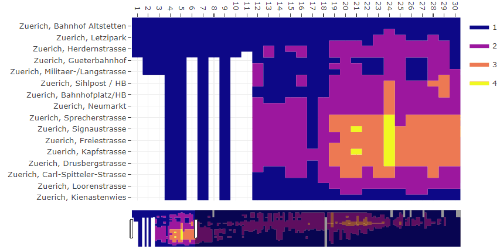
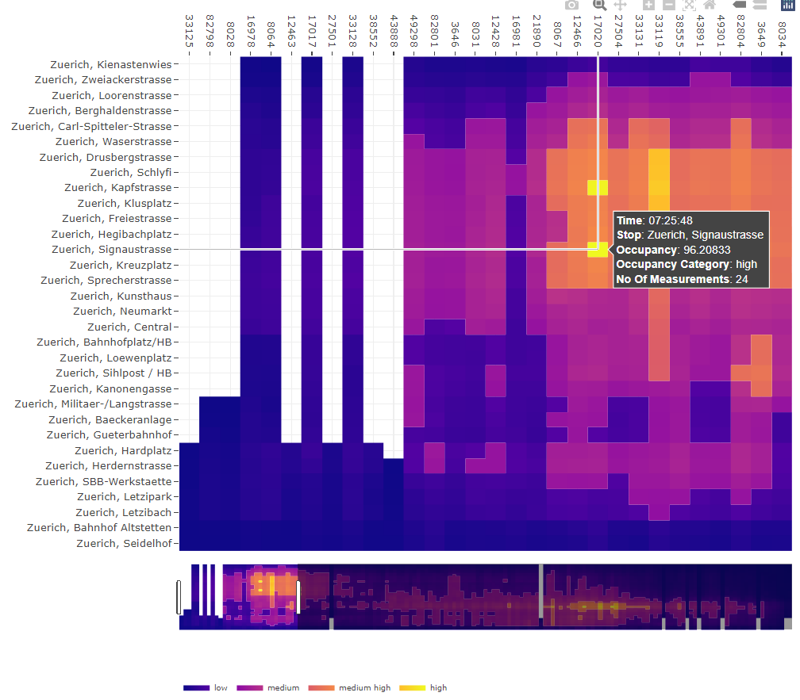

# catmaply  

[](https://github.com/VerkehrsbetriebeZuerich/catmaply/actions/) [](https://app.codecov.io/gh/VerkehrsbetriebeZuerich/catmaply) [](https://cran.r-project.org/package=catmaply)
[](https://cran.r-project.org/package=catmaply/)
[](https://cran.r-project.org/package=catmaply/)
[](https://www.stadt-zuerich.ch/vbz)

## Contents
- [Introduction](#Introduction)
- [Installation](#Installation)
- [Examples](#Examples)
- [Code of Conduct](#Code-of-Conduct)


## Introduction

A heatmap is a graphical representation of data that uses a system of color-coding to represent different values. Heatmaps are used in various forms of analytics, however, this R package specifically focuses on providing an efficient way for creating interactive heatmaps for categorical data or continuous data that can be grouped into categories. 

This package is originally being developed for Verkehrsbetriebe Zürich (VBZ), the public transport operator in the Swiss city of Zurich, to illustrate the utilization of different routes and vehicles during different times of the day. Therefore, it groups utilization data (e.g. persons per m^2) into different categories (e.g. low, medium, high utilization) and illustrates it for certain stops over time in a heatmap.

This package can easily be integrated into a shiny dashboard which supports additional interactions with other plots (e.g. boxplot, histogram, forecast) by using plotly events.

This work is based on the plotly.js engine. 

### Please submit feature requests

This package is still under active development. If you have features you would like to have added, please submit your suggestions (and bug-reports) at: <https://github.com/VerkehrsbetriebeZuerich/catmaply/issues/>

### News

You can see the most recent changes of the package in [NEWS.md](https://github.com/VerkehrsbetriebeZuerich/catmaply/blob/master/NEWS.md).


## Installation

To install the latest ("cutting-edge") GitHub version run:

```R
# make sure that you have the corrent R Tools installed.
# as you might need to build some packages from source

# if do not have RTools installed, you can install it with:
# install.packages('installr'); install.Rtools() # not tested on windows
# or download it from here:
# https://cran.r-project.org/bin/windows/Rtools/
# in any case, make sure that you select the correct version, 
# otherwise the installation will fail.

# Then you'll need devtools
if (!require('devtools'))
  install.packages('devtools')

# Finally install the package
devtools::install_github('VerkehrsbetriebeZuerich/catmaply')
```

To install the latest available version on cran, run:

```R
install.packages('catmaply')
```

And then you may load the package using:

```R
library("catmaply")
```

## Examples

To get an impression what catmaply does take a look at the following examples.

### Simple plot with default options

```R
# simple plot
library(catmaply)

# example data within catmaply
data("vbz")
df <- vbz[[3]]

catmaply(
  df,
  x = trip_seq,
  x_order = trip_seq,
  y = stop_name,
  y_order = stop_seq,
  z = occ_category
)
```
The code shown above leads to the following output



### More complex plot

catmaply brings many costumizing options for you to get the plot in the shape you want.
Also the layout options from Plotly can be used to style the plot.

```R
# a bit more complex plot,
# using some costumizing options and
# layout options from plotly

library(catmaply)
library(plotly)
library(dplyr)

# example data within catmaply
data("vbz")
df <- vbz[[3]]


catmaply(
  df,
  x = trip_id,
  x_order = trip_seq,
  y = stop_name,
  y_order = stop_seq,
  z = occupancy,
  categorical_color_range = TRUE,
  categorical_col = occ_category,
  hover_template = paste(
    "<b>Time</b>:", departure_time,
    "<br><b>Stop</b>:", stop_name,
    "<br><b>Occupancy</b>:", occupancy,
    "<br><b>Occupancy Category</b>:", occ_cat_name,
    "<br><b>No Of Measurements</b>:", number_of_measurements,
    "<extra></extra>"
  ),
  legend_col = occ_cat_name
) %>%
  layout(
    title = list(text = ""),
    # adjust hight of plot due to number of stops/observations
    height = 500 + 10 * max(df$stop_seq),
    # flip axis and use spikes
    yaxis = list(
      autorange = "reversed",
      showspikes = TRUE,
      spikedash = "solid",
      spikethickness = 0.5,
      spikecolor = "gray"
    ),
    # use spikes
    xaxis = list(
      showspikes = TRUE,
      spikedash = "solid",
      spikethickness = 0.5,
      spikecolor = "gray",
      rangeslider = list(thickness = 0.1)
    ),
    # horizontal and adjusted legend
    legend = list(
      yanchor = "top",
      y = -0.25,
      orientation = "h",
      font = list(size = 9)
    )
  )
```

The code shown above leads to the following output



### Further examples

More step-by-step examples and further descriptions can be found [here](https://cran.r-project.org/package=catmaply/vignettes/catmaply.html).


## Code of conduct

Please note that this project is released with a [Contributor Code of Conduct](https://github.com/VerkehrsbetriebeZuerich/catmaply/blob/master/CONDUCT.md). By participating in this project you agree to abide by its terms.  


